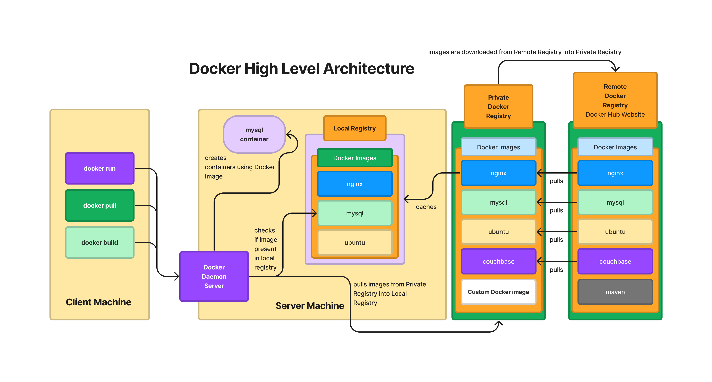

# Day 2

## Processors Packaging
- Two types of Packaing
  1. Single Chip Module (SCM - One IC has one Processor )
  2. Multiple Chip Module (MCM - One IC will have multiple Processors ) 

## Server Grade Motherboards
- supports multiple Processor Sockets
- Assume the Server has 4 Processors Sockets
- Assume we are installing MCM based Processor, i.e each IC with 4 Processors
- Assumne each Processor has 256 CPU Cores
- Total CPU Cores = 16 x 256 = 4096 CPU Cores
  
## What is Hypervisor?
- virtualization technology
- allows us to run many Operating System side by side on the same laptop/desktop/workstation/server
- in other words, many OS can be active at the same time on the same machine
- its a technology that depends on Hardware & Software
- Processor Companies
  - AMD
    - Virtualization Feature supported is called AMD-V
    - any AMD processor that has AMD-V suports Virtualization
  - Intel
    - Virtualization Feature supported is VT-X
    - any Intel process that has VT-X supports Virtualization
- there are 2 types of Hypervisors
  - Type 1 ( Bare-metal Hypervisor - used in Servers and Workstations ) and
  - Type 2 ( used in Laptops/Desktops/Workstations with some Guest OS pre-installed )

- The OS that runs within the Virtual Machine is called Guest OS
- The OS on which the Hypervisor software is installed in case of Type2 is called Host OS
- Type 1 Hypervisor doesn't require Host OS
- Type 1
  Example - VMWare vCenter/vSphere
- Type 2
- Examples
  - Oracle VirtualBox (Free but not opensource )
  - VMWare
    - Fusion ( Mac OS-X )
    - Workstation ( Windows & Linux )
  - Microsoft Hyper-V
  - Parallels ( Mac OS-X )
  - Opensource KVM ( Linux )
- The OS that runs with the Virtual Machine (VMs) is a fully functional Operating System
  - it has it own dedicated Hardware resources ( CPU Cores, RAM, Storage, Network, Graphics Card, etc., )
  - Hence the number of Virtual Machines we can create on Laptop/Desktop/Workstation/Server depends on the hardware configuration of that machine
- Hypervisor is a heavy-weight technology as each VM requires dedicated hardware resources

## What is a Container Technology ?
- light-weight application virtualization technology
- container are not OS
- containers are not equivalent to Virtual Machine
- each container runs a single application
- containers does'nt have hardware resources, also they don't have OS Kernel
- every container has its own dedicated network stack
- containers also has file-system
- because containers have network stack, file system, it appears like a OS but technically they are nothing but an application process

## What is Docker?
- developed and maintained by an organization called Docker Inc
- Docker is an application virtualization container software
- Comes in 2 flavours
  - Docker Community Edition - Docker CE
  - Docker Enterprise Edition - Docker EE

## Docker vs Hypervisor
- Docker container represents one single application
- Virtual machine represents one fully functional Operating System
- container is not a OS
- containers will never be able to replace VMs or Operating System
- they are complementing technology not competing technology

## Docker Alternatives
- Podman
- Containerd
- Rkt

## What is a Container Engine ?
- high-level software that is end-user friendly
- depends on Container Runtime to manage containers
- provides easy to use commands, without knowing low-level kernel details, one can easily create and manage container via Container Engine
- Examples
  - Docker, Podman, etc.,

### What is a Container Runtime?
- Container Runtime software is the one which knows how many containers
  - creating containers
  - listing container
  - deleting containers
  - start/stop/restarting/killing/aborting containers
- low-level softwares, hence not so end-user friendly
- normally not used by end-users directly
- commonly used by Container Engine to manage containers
- Examples
  - runC is a Container Runtime used by Docker & Containerd
  - rkt is Container Runtime used by Podman

## What is a Docker Image?
- specification or blueprint of a Container
- using Docker Image we can create one or more containers
- We can create Docker Image with some software preinstalled, hence we create containers using that Docker Image, the container will have all the softwares that we preinstalled in the Docker Image
- Docker Images are maintained with Docker Registry

## What is a Docker Container?
- running instance of a Docker Image
- Docker Container get its file system and software tools from Docker Image
- Every Docker Container runs in a separate namespace
- Every Docker Container gets an IP Address
- Each Container represents one application


## Docker High Level Architecture


# Lab Exercises

## Lab - Checking the docker version
```
docker --version
```

Expected output
<pre>
jegan@tektutor.org:~/devops-nov-2023$ docker --version
Docker version 24.0.5, build 24.0.5-0ubuntu1  
</pre>

## Lab - Listing the Docker Images from your Local Docker Registry
```
docker images
```

Expected output
<pre>
jegan@tektutor.org:~/devops-nov-2023$ docker images
REPOSITORY                                       TAG       IMAGE ID       CREATED       SIZE
releases-docker.jfrog.io/jfrog/artifactory-oss   latest    bace876f17f4   2 weeks ago   2.2GB  
</pre>

## Lab - Listing currently running containers
```
docker ps
```

Expected output
<pre>
jegan@tektutor.org:~/devops-nov-2023$ docker ps
CONTAINER ID   IMAGE                                                   COMMAND                  CREATED        STATUS        PORTS                                                           NAMES
99daa08c75be   releases-docker.jfrog.io/jfrog/artifactory-oss:latest   "/entrypoint-artifac…"   22 hours ago   Up 22 hours   0.0.0.0:8081-8082->8081-8082/tcp, :::8081-8082->8081-8082/tcp   artifactory  
</pre>


## Lab - Downloading docker image from Docker Hub Remote Registry to Local docker registry
```
docker pull hello-world:latest
```

Expected output
<pre>
jegan@tektutor.org:~/devops-nov-2023$ docker pull hello-world:latest
latest: Pulling from library/hello-world
719385e32844: Pull complete 
Digest: sha256:c79d06dfdfd3d3eb04cafd0dc2bacab0992ebc243e083cabe208bac4dd7759e0
Status: Downloaded newer image for hello-world:latest
docker.io/library/hello-world:latest
  
jegan@tektutor.org:~/devops-nov-2023$ docker images
REPOSITORY                                       TAG       IMAGE ID       CREATED        SIZE
releases-docker.jfrog.io/jfrog/artifactory-oss   latest    bace876f17f4   2 weeks ago    2.2GB
hello-world                                      latest    9c7a54a9a43c   6 months ago   13.3kB  
</pre>

## Lab - Downloading ubuntu latest docker image from Docker Hub to Local Docker Registry
```
docker images
docker pull ubuntu:latest
docker images
```

Expected output
<pre>
jegan@tektutor.org:~/devops-nov-2023$ docker pull ubuntu:latest
latest: Pulling from library/ubuntu
aece8493d397: Pull complete 
Digest: sha256:2b7412e6465c3c7fc5bb21d3e6f1917c167358449fecac8176c6e496e5c1f05f
Status: Downloaded newer image for ubuntu:latest
docker.io/library/ubuntu:latest
  
jegan@tektutor.org:~/devops-nov-2023$ docker images
REPOSITORY                                       TAG       IMAGE ID       CREATED        SIZE
releases-docker.jfrog.io/jfrog/artifactory-oss   latest    bace876f17f4   2 weeks ago    2.2GB
ubuntu                                           latest    e4c58958181a   6 weeks ago    77.8MB
hello-world                                      latest    9c7a54a9a43c   6 months ago   13.3kB  
</pre>

## Lab - Creating ubuntu containers and running them in background
```
docker run -dit --name ubuntu1 --hostname ubuntu1 ubuntu:latest /bin/bash
docker run -dit --name ubuntu2 --hostname ubuntu2 ubuntu:latest /bin/bash
docker ps
```

Expected output
<pre>
jegan@tektutor.org:~/devops-nov-2023$ docker run -dit --name ubuntu1 --hostname ubuntu1 ubuntu:latest /bin/bash
4378c8c5913a8b363af6424642b5a4f89a4ceb3c58aa6d3930627572ce84b69c
jegan@tektutor.org:~/devops-nov-2023$ docker run -dit --name ubuntu2 --hostname ubuntu2 ubuntu:latest /bin/bash
5072f6e712c38e763b8bccc7a33e89cd7f2e5e8e1de539ec78c994f3cdb4b4c7
  
jegan@tektutor.org:~/devops-nov-2023$ docker ps
CONTAINER ID   IMAGE                                                   COMMAND                  CREATED          STATUS          PORTS                                                           NAMES
5072f6e712c3   ubuntu:latest                                           "/bin/bash"              3 seconds ago    Up 2 seconds                                                                    ubuntu2
4378c8c5913a   ubuntu:latest                                           "/bin/bash"              21 seconds ago   Up 20 seconds                                                                   ubuntu1
99daa08c75be   releases-docker.jfrog.io/jfrog/artifactory-oss:latest   "/entrypoint-artifac…"   23 hours ago     Up 23 hours     0.0.0.0:8081-8082->8081-8082/tcp, :::8081-8082->8081-8082/tcp   artifactory  
</pre>

## Lab - Renaming a container
```
docker run hello-world:latest
docker ps -a
docker rename eager_montalcini c1
docker ps -a
```

Expected output
<pre>
jegan@tektutor.org:~/devops-nov-2023$ docker ps -a
CONTAINER ID   IMAGE                                                   COMMAND                  CREATED          STATUS                      PORTS                                                           NAMES
2f62aecd7bf8   hello-world:latest                                      "/hello"                 18 seconds ago   Exited (0) 17 seconds ago                                                                   eager_montalcini
5072f6e712c3   ubuntu:latest                                           "/bin/bash"              5 minutes ago    Up 5 minutes                                                                                ubuntu2
4378c8c5913a   ubuntu:latest                                           "/bin/bash"              5 minutes ago    Up 5 minutes                                                                                ubuntu1
99daa08c75be   releases-docker.jfrog.io/jfrog/artifactory-oss:latest   "/entrypoint-artifac…"   23 hours ago     Up 23 hours                 0.0.0.0:8081-8082->8081-8082/tcp, :::8081-8082->8081-8082/tcp   artifactory
  
jegan@tektutor.org:~/devops-nov-2023$ docker rename eager_montalcini c1
  
jegan@tektutor.org:~/devops-nov-2023$ docker ps -a
CONTAINER ID   IMAGE                                                   COMMAND                  CREATED         STATUS                     PORTS                                                           NAMES
2f62aecd7bf8   hello-world:latest                                      "/hello"                 2 minutes ago   Exited (0) 2 minutes ago                                                                   c1
5072f6e712c3   ubuntu:latest                                           "/bin/bash"              7 minutes ago   Up 7 minutes                                                                               ubuntu2
4378c8c5913a   ubuntu:latest                                           "/bin/bash"              8 minutes ago   Up 8 minutes                                                                               ubuntu1
99daa08c75be   releases-docker.jfrog.io/jfrog/artifactory-oss:latest   "/entrypoint-artifac…"   23 hours ago    Up 23 hours                0.0.0.0:8081-8082->8081-8082/tcp, :::8081-8082->8081-8082/tcp   artifactory  
</pre>

## Lab - Creating a Custom Docker Image with required software tools
```
cd ~/devops-nov-2023
git pull
cd Day2/CustomDockerImage
docker build -t tektutor/ubuntu:latest .
docker images
```

Expected output


Creating a container using our custom docker image
```
docker run -dit --name ubuntu3 --hostname ubuntu3 tektutor/ubuntu:latest /bin/bash
docker ps
docker exec -it ubuntu3 /bin/bash
ifconfig
ping www.google.com
exit
```

Expected output


## Lab - Stopping a running container
```
docker ps
docker stop ubuntu3
docker ps
docker ps -a
```

Expected output


## Lab - Starting a exited container
```
docker ps -a
docker start ubuntu3
docker ps
```

Expected output


## Lab - Restarting a running container
```
docker ps
docker restart ubuntu3
docker ps
```

Expected output


## Lab - Deleting a single running container
```
docker ps
docker rm ubuntu1
docker stop ubuntu1
docker rm ubuntu1
docker ps
docker ps -a
```

Expected output


## Lab - Deleting multiple running containers
```
docker ps
docker stop ubuntu2 ubuntu3
docker rm ubuntu2 ubuntu3
```

Expected output


## Lab - Deleting multiple containers forcibly without naming them
```
docker ps -a
docker rm -f $(docker ps -aq)
docker ps -a
```

Expected output


## Lab - Creating a Load Balancer with nginx container image
```
docker run -d --name web1 --hostname web1 nginx:latest
docker ps
```

Expected output


Finding IP Address of nginx web1 container
```
docker inspect web1 | grep IPA
docker inspect -f {{.NetworkSettings.IPAddress}} web1
```

Expected output


Let's create 2 more web container and a single lb container using nginx docker image
```
docker ps
docker run -d --name web2 --hostname web2 nginx:latest
docker run -d --name web3 --hostname web3 nginx:latest
docker run -d --name lb --hostname lb nginx:latest

docker inspect -f {{.NetworkSettings.IPAddress}} web2
docker inspect -f {{.NetworkSettings.IPAddress}} web3
docker inspect -f {{.NetworkSettings.IPAddress}} lb
```

Expected ouput


Accessing the web pages from web1, web2, web3 and lb container
```
curl 172.17.0.2:80
curl 172.17.0.3
curl 172.17.0.4
curl 172.17.0.5
```

Expected output


Customizing the web pages on web1, web2 and web3 container so that we can differentiate the responses from each web server
```
cd ~/devops-nov-2023
git pull
cd Day2/lb

echo "Web Server 1" > index.html
docker cp index.html web1:/usr/share/nginx/html/index.html

echo "Web Server 2" > index.html
docker cp index.html web2:/usr/share/nginx/html/index.html

echo "Web Server 3" > index.html
docker cp index.html web3:/usr/share/nginx/html/index.html

curl 172.17.0.2
curl 172.17.0.3
curl 172.17.0.4
```

Expected ouput


Now, let's configure the lb container to work like a Load Balancer. We need to copy the default nginx.conf file present in the lb container to our local machine to configure the file.

Before copying the nginx.conf from devops-nov-2023/Day2/lb folder into the lb container, you need to find the IP addresses of your web1, web2 and web3 container and appropriately configure the nginx.conf with those IPs
```
cd ~/devops-nov-2023
git pull
cd Day2/lb
docker cp nginx.conf lb:/etc/nginx/nginx.conf
```

To apply the config changes, we need to restart the lb container
```
docker restart lb
```

Now you can try accessing the lb container IP address to check if it is working like a load balancer, you need to replace the below IP address with your lb container IP
```
http://172.17.0.5
```
Try the above from a web browser on the RPS lab machine.

Expected output


## Lab - Using port-forwarding to expose lb container service to outside world
We first need to delete the lb container
```
docker ps
docker rm -f lb
```

We need to create a new lb container with port-forwarding
```
docker run -d --name lb --hostname lb -p 9000:80 nginx:latest
```

Let's copy the nginx.conf to make lb container a load balancer. You need to update the nginx.conf web1, web2 and web3 containers IP addresses with your web1, web2 and web3 IP addresses
```
cd ~/devops-nov-2023
git pull
cd Day2/lb
docker cp nginx.conf lb
docker restart lb
docker ps
```

## Lab - Creating a mysql db container
```
docker run -d --name db --hostname db mysql:latest
docker ps
```

Expected output

